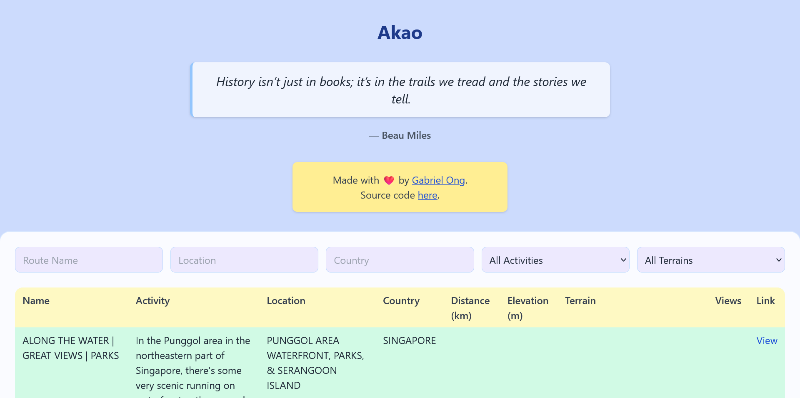
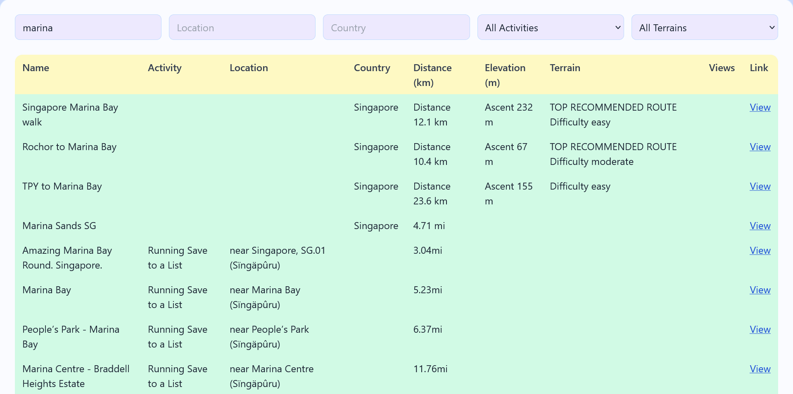
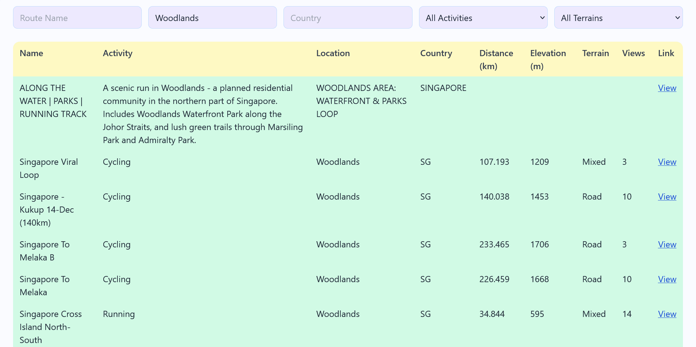
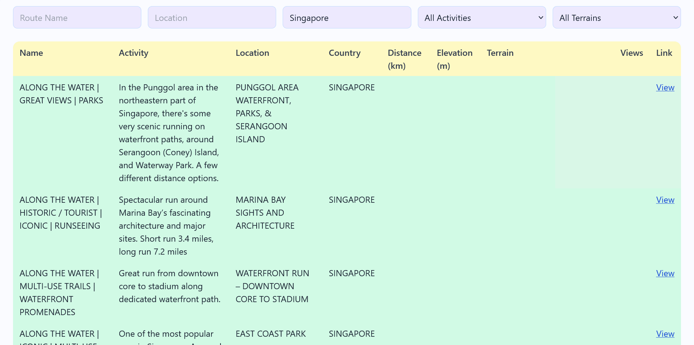
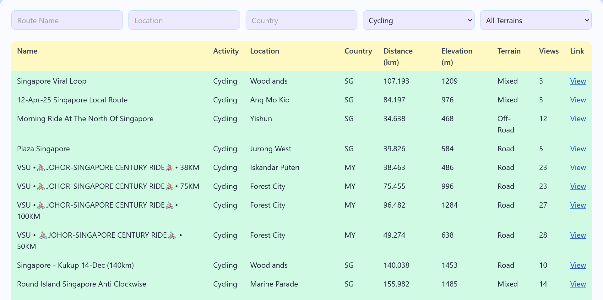
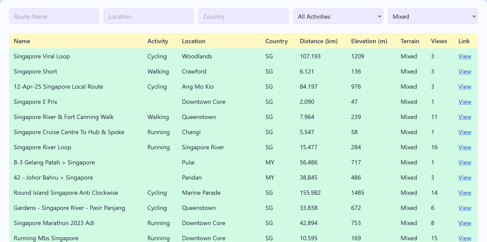
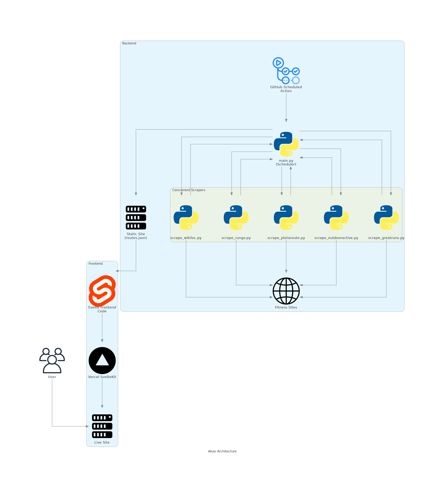

 

# `Akao`

...

## Rationale

...

## Stack

* *Frontend*: [Svelte](https://svelte.dev/), [JavaScript](https://developer.mozilla.org/en-US/docs/Web/JavaScript)
* *Backend*: [Github Actions](https://github.com/features/actions), [Python](https://www.python.org/)
* *Package*: [Docker](https://www.docker.com/)

## Screenshots

  
  

 

  
  

 

  q
  

## Coverage

`Akao` currently scrapes the following sites [monthly](#architecture).

| Site | Status |
| :--- | :--- |
| [AllTrails](https://www.alltrails.com/) |  |
| [Great Runs](https://greatruns.com/) |  |
| [Outdooractive](https://www.outdooractive.com/en/) |  |
| [Plotaroute](https://www.plotaroute.com/) |  |
| [RunGo](https://www.rungoapp.com/) |  |
| [Wikiloc](https://www.wikiloc.com/) |  |
| [Strava](https://www.strava.com/) |  |

## Usage

...

## Architecture

## Reference

The name `Akao` is in reference to [Rion Akao](https://sakamoto-days.fandom.com/wiki/Rion_Akao), a close friend of [Taro Sakamoto](https://sakamoto-days.fandom.com/wiki/Taro_Sakamoto) and [Yoichi Nagumo](https://sakamoto-days.fandom.com/wiki/Yoichi_Nagumo) from their time as students at [JCC](https://sakamoto-days.fandom.com/wiki/Japan_Clear_Creation). She first appears in the [Taro Sakamoto's Past Arc](https://sakamoto-days.fandom.com/wiki/Taro_Sakamoto%27s_Past_Arc) under the ongoing manga series [Sakamoto Days](https://sakamoto-days.fandom.com/wiki/Sakamoto_Days_Wiki).

    

